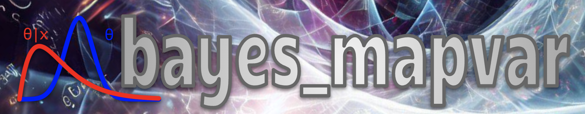

|PyPI Version| |License|
Bayesian MAP / Variance Estimation
==================================================

Installation
------------
1. Clone the repository.
2. Navigate to the project root directory.
3. Create the virtual environment with:
> `. bin/setup_venv.sh`

Testing
-------
To run unit tests, run this from the project root directory:
> `. bin/run_unit_tests.sh`

.. |PyPI Version| image:: https://img.shields.io/pypi/v/bayes_mapvar.svg
   :target: https://pypi.org/project/bayes_mapvar/
.. |License| image:: https://img.shields.io/pypi/l/bayes_mapvar.svg
